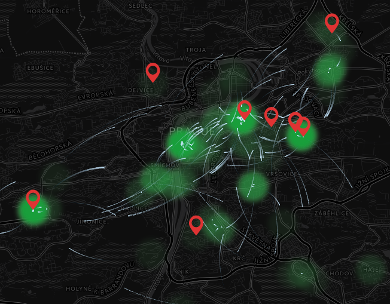

# Carshare exporter visualisation

> Cars on map

## What is this

This is supposed to work with metrics [prometheus-carshare-exporter](https://github.com/ra100/prometheus-carshare-exporter)



## Build Setup

Copy `config/local.example.js` to `config/local.js` and change configuration.

``` bash
# install dependencies
npm install

# serve with hot reload at localhost:8080
npm run dev

# build for production with minification
npm run build

# build for production and view the bundle analyzer report
npm run build --report
```

For detailed explanation on how things work, checkout the [guide](http://vuejs-templates.github.io/webpack/) and [docs for vue-loader](http://vuejs.github.io/vue-loader).

## TODO

- [ ] Add controls
- [ ] Manual refresh
- [ ] Select just one car
- [ ] Change time
- [ ] Show more data

## License

